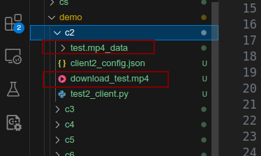

# Notation:
- kill process:
```shell
netstat -nl | grep 6667
sudo fuser -k 6653/tcp
```

- create mininet topography
`sudo mn --topo=single,3`

# 端到端测试：
## `C2` 从 `seed` 接收文件

### 需要修改的参数：
1. `backend/server.py` 中: *SERVER_IP* 需要修改
```py
#TODO: Some parameters of Tracker, you can change there
SERVER_IP = utilities.get_host_ip()
#! Mininet Test
# SERVER_IP = '10.0.0.1'
```
2. `demo/make_torrent_and_start_tracker.py` 中：*TRACKER_IP* 需要修改

3. `demo/seed`, `demo/c2` 对应python文件的 *IP* 也得修改

### 如何运行
3. `# 在demo文件夹下
python3 make_torrent_and_start_tracker.py`
1. `cd seed
python3 seed_client.py
cd c2
python3 test2_client.py`

### 运行过程:
> **Tracker:** 
> 
> 
> 
> **seed:**
> 
>
> **c2 client:**
> 

### 结果
#### Before Transfer:
>
>
#### After:
> 
> 


## mininet测试

### 可能需要用到的命令
1. 下载 `mininet xterm` python环境的库，以`psutil`为例
```shell
sudo mnexec pip install psutil
```
2. 打开对应节点的终端:
```sh
xterm tracker 
```

### 需要修改的参数：
1. `backend/server.py` 中: *SERVER_IP* 需要修改
```py
#TODO: Some parameters of Tracker, you can change there
SERVER_IP = utilities.get_host_ip()
#! Mininet Test
# SERVER_IP = '10.0.0.1'
```
2. `demo/make_torrent_and_start_tracker.py` 中：*TRACKER_IP* 需要修改

3. `demo/seed`, `demo/c2` 对应python文件的 *IP* 也得修改

### 如何运行：
先生成对应拓扑结构，进入`demo/mininet`后`sudo python test.py` 即可（对应代码可改），然后xterm name 打开name节点（主机）的终端
在对应xterm打开的终端下进入对应的文件夹（和端到端一样）运行对应的文件即可
