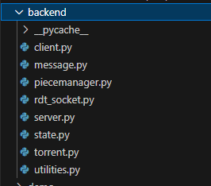
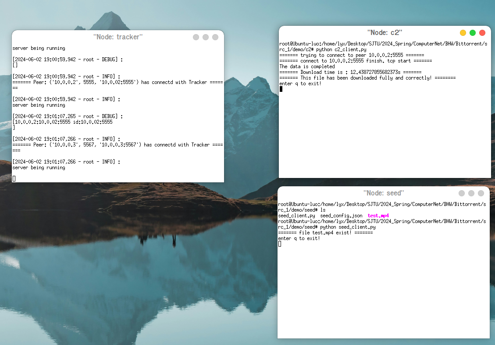
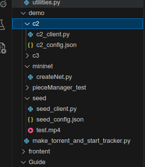
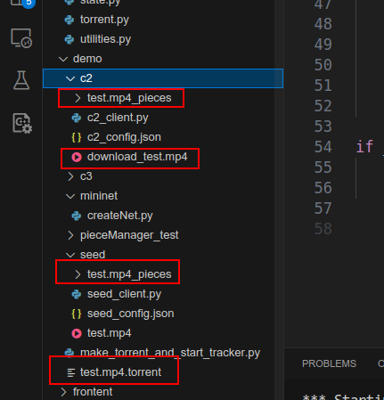
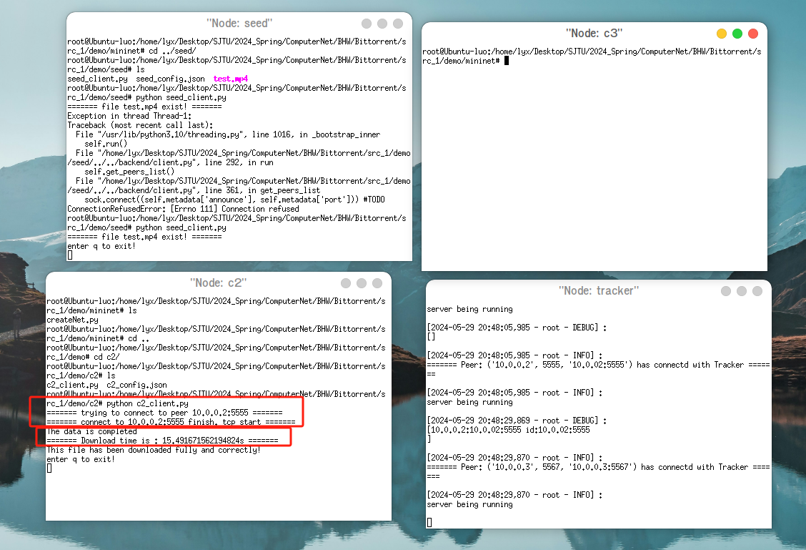
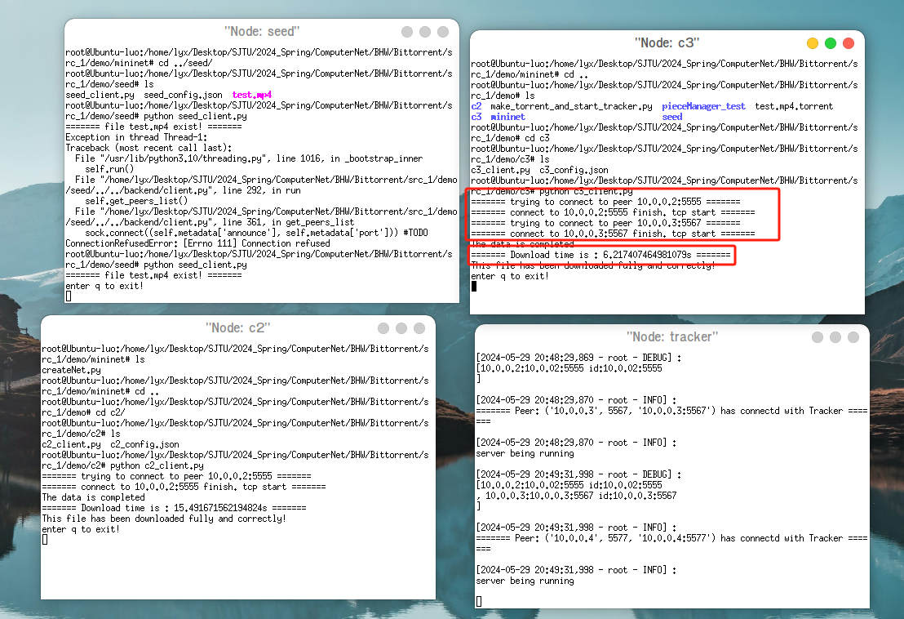
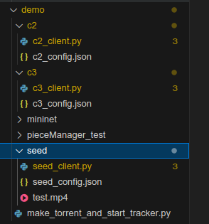
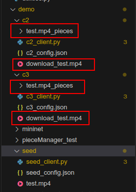

# <center>BitTorrent 大作业报告</center>
*******

## 1.文件基本结构和实现
*******
> 
- `client.py`: 负责实现客户端，调用`rad_socker.py` 来建立连接，调用 `messsage.py` 实现发送不同的状态信息，调用`piecemanager.py` 来管理接收到的或者现有的**块文件**
- `server.py`：实现服务器端，主要时给连接的peer提供其他peers的信息：IP和端口
- `state.py`：定义了peer的state（发送块还是接收块等等）
- `torrent.py`: 定义了 *.torrent* 文件的制作，读取，以及hash值的验证等功能
- `utilities.py`：定义了一些常用工具函数

## 2. 测试（主要在`./demo`文件夹下进行）
******
### 2.1 不同测试场景需要修改的参数：
1. `backend/server.py` 中: *SERVER_IP* 需要修改
```py
#TODO: Some parameters of Tracker, you can change there
SERVER_IP = utilities.get_host_ip()
#! Mininet Test
# SERVER_IP = '10.0.0.1'
```
2. `demo/make_torrent_and_start_tracker.py` 中：*TRACKER_IP* 需要修改
3. `demo/seed`, `demo/c2` 对应python文件的 *IP* 也得修改

### 2.2 端到端测试：`C2` 从 `seed` 接收文件

#### 运行过程
```sh
# 在demo文件夹下
python3 make_torrent_and_start_tracker.py`
# 进入seed文件夹
cd seed
python3 seed_client.py
# 进入c2文件夹
cd c2 
python3 test2_client.py
```

##### 运行过程:
> 
##### 文件传输前后对比:
>  


### 2.3 mininet测试

#### 2.3.1 可能需要用到的命令
1. 下载 `mininet xterm` python环境的库，以`psutil`为例
```shell
sudo mnexec pip install psutil
```
2. 打开对应节点的终端:
```sh
xterm tracker 
```

#### 2.3.2 如何运行：
先生成对应拓扑结构，进入`demo/mininet`后`sudo python test.py` 即可（对应代码可改），然后xterm name 打开name节点（主机）的终端
在对应xterm打开的终端下进入对应的文件夹（和端到端一样）运行对应的文件即可

#### 2.3.3 c2 从 seed 获取文件
图中可以看出时间大约为：15.5s
> 

#### 2.3.4 c3 同时从 c2 和 seed 获取文件：
图中可以看出时间大约为：6.2s
> 


#### 2.3.5 运行前后对比：
>  

## 3 策略优化